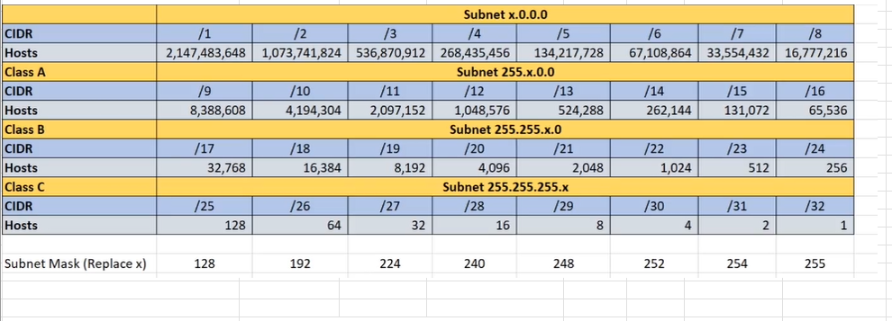

## **FINDING NETWORK IP, NUMBER OF HOSTS, RANGE OF IP ADDRESSES AND BROADCAST IP FROM 193.16.20.35/29**

#

## ***I USUALLY LIKE TO USE TABLES FOR THIS TYPE OF SOLUTION***

# **LET US FIND THE NETWORK IP**
            FINDING  NETWORK  ID		                                       					
	empty	128	64	32	16	8	4	2	1
	193	 1	1	0	0	0	0	0       1
	168	 1	0	1	0	1	0	0	0
	20	 0	0	0	1	0	1	0       0
									
	35	 0	0	1	0	0	0	1       1
#
     193	         168	             20	            35
    11000001	 10101000	  00010100	  00100011

#

     		 FINDING BROADCAST  ID					
	empty	128	64	32	16	8	4	2	1
	255	 1	1	1	1	1	1	1	1
	255	 1	1	1	1	1	1	1	1
	255	 1	1	1	1	1	1	1	1
    248      1	1	1	1	1	0	0	0

#

            255	          255	          255	          248	

          11111111	        11111111	11111111	11111000	

# **USING AND OPERATION TO ADD IP AND SUBNET**:

     IP TO BINARY        11000001    10101000	 00010100	  00100011			

     SUBNETMASK          11111111	 11111111        11111111	  11111000		

      NETWORK(AND)       11000001	 10101000	 00010100         00100000									
#
                                0	0	1	0	0	0	0	0

              ON (1 MEANS ON) 128	164	32	16	8	4	2	1	

## NETWORK ADDRESS = 193.168.20.32	
#

# **FINDING BROADCAST IP, YOU INVERT SUBNETMASK AND USE OR OPERATION TO ADD**		            
                    
   
     
                          
     NETWORK            11000001	10101000     00010100	00100000

     SUBNET MASK        00000000	00000000     00000000	00000111		

     BROADCAST(OR)	11000001        10101000     00010100	00100111			

  
  #
		        					
								
    ON (1 MEANS ON)	0	0	1	0	0	1	1	1
	               128	164	32	16	8	4	2	1

#
 ## BROADCAST ADDRESS = 193.168.20.39	
#
    IST HOST ADDRESS (ADD ONE TO NETWORK) LAST OCTET		                                              193.168.20.33

    LAST HOST ADDRESS (SUBTRACT ONE FROM FRIOM BROADCAST ADDRESS)		                              193.168.20.38

    NUMBER OF HOST, IS COUNT HOW MANY O'S ARE IN THE LAST OCTET OF NETWORK IP AND USE 2 RAISE TO THE POWER OF NUMBER OF 0'S AND THEN SUBTRACT   2^3	8 - 2 = 6	
    
                                                                                                                                               

