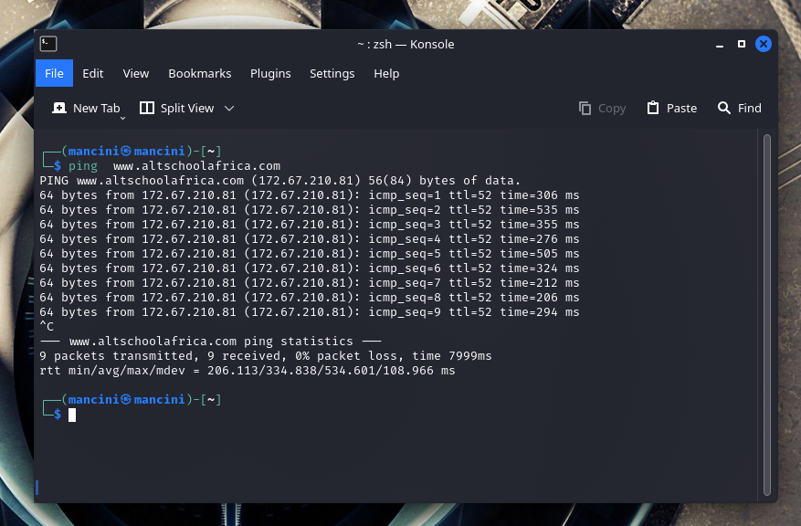

  # 10 __LINUX COMMANDS__

  The main goal is to 10 various Linux command that you can use in any linux operating systems, along with some few examples and screenshots

  Below are some examples:

# 1. **PING COMMAND**-
The ping command sends packets of data to a specific IP address on a network, and then lets you know how long it took to transmit that data and get a response. It’s a handy tool that you can use to quickly test various points of your network.

I am  going to use the zsh terminal here in my example here. But you can also use the ping command in Windows PowerShell, or in the Terminal app on macOS or any Linux distro. Once you get to using the actual command, it works the same everywhere.

Example of how to use ping is: kali@kali.com-  ping www.altschoolafrica.com

# 2. **NETSTAT COMMAND**-
The netstat command generates displays that show network status and protocol statistics. You can display the status of TCP and UDP endpoints in table format, routing table information, and interface information.netstat displays various types of network data depending on the command line option selected. These displays are the most useful for system administration. The syntax for this form is:netstat [-m] [-n] [-s] [-i | -r] [-f address_family]

Example of how to use Netstat would be:  netstat -a   (This will list all you current connection)

Example below will show you all the network interfaces in your system. It is similar to IP config

This will show you your Gateway and route

# 3.**NET DISCOVER**- 
Netdiscover is an active/passive address reconnaissance tool, mainly developed for those wireless networks without dhcp server, when you are wardriving. It can be also used on hub/switched networks.Built on top of libnet and libpcap, it can passively detect online hosts, or search for them, by actively sending ARP requests.Netdiscover can also be used to inspect your network ARP traffic, or find network addresses using auto scan mode, which will scan for common local networks.Netdiscover uses the OUI table to show the vendor of the each MAC address discovered and is very useful for security checks or in pentests.

Example of how to use ping is: kali@kali.com-   netdiscover -i  wlan0

# 4. **LOCATE COMMAND**-
The locate command is a Unix utility used for quickly finding files and directories. The command is a more convenient and efficient alternative to the find command, which is more aggressive and takes longer to complete the search.Opposite to find, the locate command doesn't search the entire filesystem, but looks through a regularly updated file database in the system. Thus, the search completes much faster.

Example of locate command is: kali@kali.com  - locate git

# 5. **REBOOT COMMAND**-
Reboot command is used restart or reboot the system. In a Linux system administration, there comes a need to restart the server after the completion of some network and other major updates. It can be of software or hardware that are being carried on the server. The reboot is needed so that the changes that the user have done can be affected on the server. For example, if the user is re-compiling the server’s kernel that is going through some more advanced server administration, then he needs to restart the machine in order to complete the compilation and to have a new updated kernel version on the server. When Updating the server’s memory, IP allocation, NIC configuration are the key tasks that need to be done on the server restarted once leading to their successful implementation. Most of the Linux system administrators access their servers via shell or SSH to perform a bunch of administrative activities, server management, and monitoring. So they need to know the basic commands to restart the server from the shell.

# 6. **IPTABLES**-
iptables is a command line interface used to set up and maintain tables for the Netfilter firewall for IPv4, included in the Linux kernel. The firewall matches packets with rules defined in these tables and then takes the specified action on a possible match.

    Tables is the name for a set of chains.
    Chain is a collection of rules.
    Rule is condition used to match packet.
    Target is action taken when a possible rule matches. Examples of the target are ACCEPT, DROP, QUEUE.
    Policy is the default action taken in case of no match with the inbuilt chains and can be ACCEPT or DROP.

     CHAINS

There are few built-in chains that are included in tables. They are:

    INPUT :set of rules for packets destined to localhost sockets.
    FORWARD :for packets routed through the device.
    OUTPUT :for locally generated packets, meant to be transmitted outside.
    PREROUTING :for modifying packets as they arrive.
    POSTROUTING :for modifying packets as they are leaving.

- root@localhost:~# iptables  -F
- root@localhost:~# apt-get install iptables   (TO INSTALL IF YOU DON'T HAVE)
- root@localhost:~# iptables -L                 (IT WILL GIVE US THE VARIOUS  CHAINS)

- root@localhost:~# iptables  man iptables
- root@localhost:~# iptables  --policy  INPUT ACCEPT
- root@localhost:~# iptables  -L                                                      (THIS WILL SHOW YOU LIST OF YOUR CURRENT SETTINGS)
- root@localhost:~# iptables   -I  INPUT  -s 10.0.0.1  -j DROP                       (THIS WILL DROP THIS IP ADDRESS FROM CONNECTING TO THE SERVER)
- root@localhost:~# iptables  -L
- root@localhost:~# iptables  -L --line-numbers
- root@localhost:~# iptables  -D INPUT 1                                              (DELETING THE FIRST RULE)
- root@localhost:~# iptables  -D INPUT 1                                             (DELETING THE SECOND RULE)
- root@localhost:~# iptables  -I  OUTPUT  -s  10.0.0.1  -j DROP          (THIS WILL BLOCK AN IP FROM CONNECTION TO A SITE.MAYBE FACEBOOK IN THE COMPANY) SITE
- root@localhost:~# iptables   -I  INPUT  -p  tcp  --dport  80  -j  DROP    (THIS MEAN BLOCKING ANYONE FROM ACCESSING THE SERVER ON PORT 80 WHICH IS THE WEBSERVER)
- root@localhost:~# iptables   -I  INPUT  -p  tcp  --dport  80  -s 197.211.1.6  -j  ACCEPT  (THIS WILL FILTER TO  ALLOW A PARTICULAR PUBLIC IP TO CONNECT TO THE SERVER)
- root@localhost:~# iptables   -L                                                  (THIS WILL SHOW YOU LIST OF YOUR CURRENT SETTINGS)
- root@localhost:~# sudo /sbin/iptables-save                                       (THIS WILL SAVE YOUR IP  RULES)
- root@localhost:~# iptables   -F                                                 (THIS WILL CLEAR  ALL THE RULES)

# 7. **CAL COMMAND**-
If a user wants a quick view of the calendar in the Linux terminal, cal is the command for you. By default, the cal command shows the current month calendar as output.

cal command is a calendar command in Linux which is used to see the calendar of a specific month or a whole year.

Syntax- root@localhost:# cal December 2018 (SHOWS DATE OF DECEMBER 2018)
        root@localhost:# cal -y            (SHOWS COMPLETE YEAR)

# 8.**WHEREIS COMMAND**-
whereis command is used to find the location of source/binary file of a command and manuals sections for a specified file in Linux system. If we compare whereis command with find command they will appear similar to each other as both can be used for the same purposes but whereis command produces the result more accurately by consuming less time comparatively. whereis doesn’t require any root privilege to execute in any RHEL/CentOS 7.

syntax - root@localhost:# whereis flameshot

9.HISTORY COMMAND-
The history command in Linux is a built-in shell tool that displays a list of commands used in the terminal session. history allows users to reuse any listed command without retyping it.

syntax -  root@localhost:# history

# 10.IP ADDR SHOW COMMAND-
List all Ip addresses and network Interfaces

