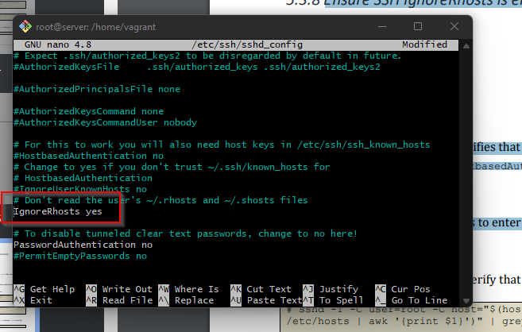

# **10 SECURITY HARDENING FOR UBUNTU 20.04 LTS BENCHMARK V.1.1.0**

# 1. Ensure SSH X11 forwarding is disabled (Automated)

### The X11Forwarding parameter provides the ability to tunnel X11 traffic through an
### existing SSH shell session to enable remote graphic connections.

# Rationale:
### Disable X11 forwarding unless there is an operational requirement to use X11 applications
### directly. There is a small risk that the remote X11 servers of users who are logged in via
### SSH with X11 forwarding could be compromised by other users on the X11 server. Note
### that even if X11 forwarding is disabled, users can always install their own forwarders.###
## Impact:
### X11 programs on the server will not be able to be forwarded to a ssh-client display.
# Security advice
### Edit /etc/ssh/sshd_config 0r a file in /ssh/sshd_config.d/ending in.conf

### Set x11 Forwarding no

# 2. Ensure SSH MaxAuthTries is set to 4 or less (Automated)

### The MaxAuthTries parameter specifies the maximum number of authentication attempts
### permitted per connection. When the login failure count reaches half the number, error
### messages will be written to the syslog file detailing the login failure.
# Rationale:
### Setting the MaxAuthTries parameter to a low number will minimize the risk of successful
### brute force attacks to the SSH server. While the recommended setting is 4, set the number
### based on site policy.
# Security advice
### Edit /etc/ssh/sshd_config 0r a file in /ssh/sshd_config.d/ending in.conf

### Set MaxAuthTries  4

# 3. Ensure SSH IgnoreRhosts is enabled (Automated)

### The IgnoreRhosts parameter specifies that .rhosts and .shosts files will not be used in
### RhostsRSAAuthentication or HostbasedAuthentication.
# Rationale:
### Setting this parameter forces users to enter a password when authenticating with ssh.
# Security advice
### Edit /etc/ssh/sshd_config 0r a file in /ssh/sshd_config.d/ending in.conf

### Set  IgnoreRhosts yes

# 4. Ensure SSH root login is disabled (Automated)

### The PermitRootLogin parameter specifies if the root user can log in using ssh.
# Rationale:
### Disallowing root logins over SSH requires system admins to authenticate using their own
### individual account, then escalating to root via sudo. This in turn limits opportunity for nonrepudiation and provides a clear audit trail in the event of a security incident
# Security advice
### Edit /etc/ssh/sshd_config 0r a file in /ssh/sshd_config.d/ending in.conf

### set PermitRootLogin no

# 5. Ensure SSH PermitEmptyPasswords is disabled (Automated)

# Rationale:
### The PermitEmptyPasswords parameter specifies if the SSH server allows login to accounts
### with empty password strings.
### Disallowing remote shell access to accounts that have an empty password reduces the
### probability of unauthorized access to the system
# Security advice
### Edit /etc/ssh/sshd_config 0r a file in /ssh/sshd_config.d/ending in.conf

### set PermitEmptyPasswords no

# 6.  Ensure SSH PermitUserEnvironment is disabled (Automated)

### The PermitUserEnvironment option allows users to present environment options to the
### ssh daemon.
# Rationale:
### Permitting users the ability to set environment variables through the SSH daemon could
### potentially allow users to bypass security controls (e.g. setting an execution path that has
### ssh executing a Trojan’s programs)
# Security advice
### Edit /etc/ssh/sshd_config 0r a file in /ssh/sshd_config.d/ending in.conf

### Set PermitUserEnvironment no

# 7. Ensure SSH Idle Timeout Interval is configured (Automated)

### The two options ClientAliveInterval and ClientAliveCountMax control the timeout of
### ssh sessions.
### *ClientAliveInterval sets a timeout interval in seconds after which if no data has*
### *been received from the client, sshd will send a message through the encrypted*
### *channel to request a response from the client. The default is 0, indicating* *that these*
### *messages will not be sent to the client.*

### *ClientAliveCountMax sets the number of client alive messages which may be sent*
### *without sshd receiving any messages back from the client. If this threshold is*
### *reached while client alive messages are being sent, sshd will disconnect the client,*
### *terminating the session. The default value is 3.*
### *The client alive messages are sent through the encrypted channel*
### *Setting ClientAliveCountMax to 0 disables connection termination*
### *Example: If the ClientAliveInterval is set to 15 seconds and theClientAliveCountMax is*
### *set to 3, the client ssh session will be terminated after 45 seconds of idle time.*
# Rationale:
### Having no timeout value associated with a connection could allow an ssh session to remain
### active after the connection with the client has been interrupted. Setting a timeout value
### reduces this risk.

### The recommended ClientAliveInterval setting is 300 seconds (5 minutes)
### The recommended ClientAliveCountMax setting is 3
### The ssh session would send three keep alive messages at 5 minute intervals. If no
### response is received after the third keep alive message, the ssh session would be
### terminated after 15 minutes.
# Security advice
### Edit /etc/ssh/sshd_config 0r a file in /ssh/sshd_config.d/ending in.conf

### Set ClientAliveInterval 300
### Set AliveCountMax 3

# 8. Ensure SSH LoginGraceTime is set to one minute or less
### (Automated)

# Description:
### The LoginGraceTime parameter specifies the time allowed for successful authentication to
### the SSH server. The longer the Grace period is the more open unauthenticated connections
### can exist. Like other session controls in this session the Grace Period should be limited to
### appropriate organizational limits to ensure the service is available for needed access.
# Rationale:
### Setting the LoginGraceTime parameter to a low number will minimize the risk of successful
### brute force attacks to the SSH server. It will also limit the number of concurrent
### unauthenticated connections While the recommended setting is 60 seconds (1 Minute), set
### the number based on site policy
# Security advice
### Edit /etc/ssh/sshd_config 0r a file in /ssh/sshd_config.d/ending in.conf

### set LoginGraceTime 60       (60 Seconds)

# 9. Ensure SSH warning banner is configured (Automated)

# Description:
### The Banner parameter specifies a file whose contents must be sent to the remote user
### before authentication is permitted. By default, no banner is displayed.
# Rationale:
### Banners are used to warn connecting users of the particular site's policy regarding
### connection. Presenting a warning message prior to the normal user login may assist the
### prosecution of trespassers on the computer system.
# Security advice
### Edit /etc/ssh/sshd_config 0r a file in /ssh/sshd_config.d/ending in.conf

### Set Banner /etc/issue.net

# 10.Ensure SSH AllowTcpForwarding is disabled (Automated)

# Description:
### SSH port forwarding is a mechanism in SSH for tunneling application ports from the client
### to the server, or servers to clients. It can be used for adding encryption to legacy
### applications, going through firewalls, and some system administrators and IT professionals
### use it for opening backdoors into the internal network from their home machines
# Rationale:
### Leaving port forwarding enabled can expose the organization to security risks and backdoors.
### SSH connections are protected with strong encryption. This makes their contents invisible
### to most deployed network monitoring and traffic filtering solutions. This invisibility carries
### considerable risk potential if it is used for malicious purposes such as data exfiltration.
### Cybercriminals or malware could exploit SSH to hide their unauthorized communications,
### or to exfiltrate stolen data from the target network
# Impact:
### SSH tunnels are widely used in many corporate environments that employ mainframe
### systems as their application backends. In those environments the applications themselves
### may have very limited native support for security. By utilizing tunneling, compliance with
### SOX, HIPAA, PCI-DSS, and other standards can be achieved without having to modify the
### applications.
# Security advice
### Edit /etc/ssh/sshd_config 0r a file in /ssh/sshd_config.d/ending in.conf

### Set AllowTcpForwarding no

